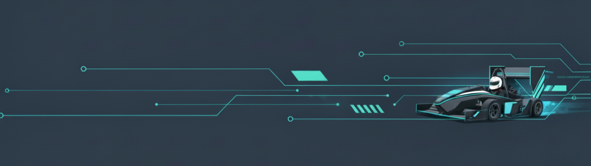

## 👋 Hi, I'm Daniele Gotti

🎓 **Master’s Student** 

Computer Engineering (Data Science & Data Engineering) at the University of Bergamo, Italy 🇮🇹. Focus in Machine Learning, AI, mathematical modeling, optimization, modern software development.

🏎️ **Formula Student** 

Software Engineer (Data & Telemetry) for E-Racing Bergamo. I designed and implemented a complete real-time data acquisition and visualization system from scratch, enabling live monitoring and post-session analysis.  

🎵 **Classical Guitar**  

Finalizing a Conservatory degree in Classical Guitar. This path taught me discipline, strong focus, and how to perform under pressure. 

🚀 **Career Goals**  

Seeking a challenging role in the Automotive/Motorsport sector(R&D, Data or Software) to drive innovation and performance.

## 🔧 Tech Stack

<h3 align="center">🛠 Tech Stack</h3>

  
  
  
  
  
  
  
  
    
  
  
  
  
  
  
  
  

## 📫 Contact

---

---
